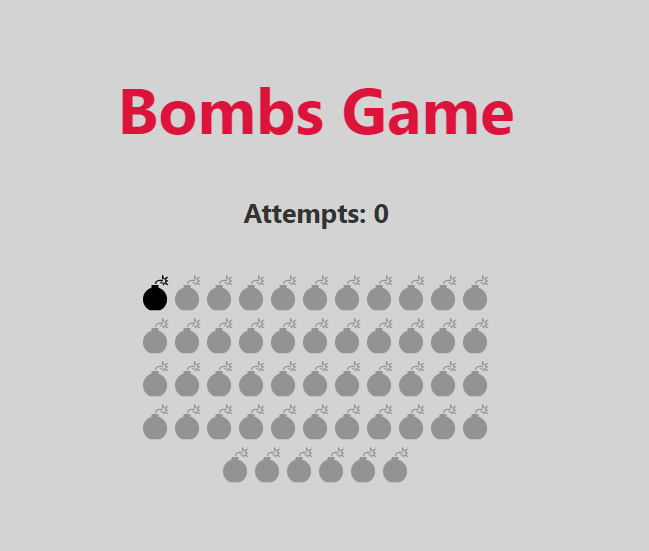
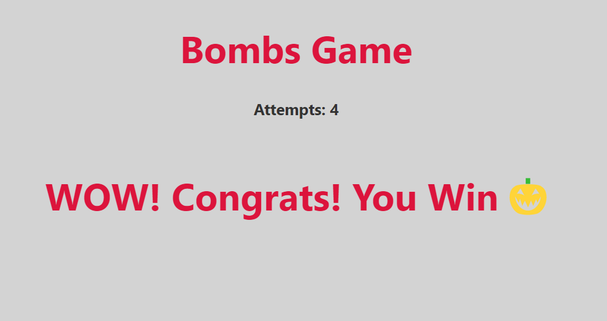

# svelte app
## A Bombs game build with svelte js . this repo containts some test work for learning svelte js 
```bash
A test project with SVELTE JS
```

*Note that you will need to have [Node.js](https://nodejs.org) installed.*


## Get started

How to install this project
```bash
git clone https://github.com/tauseedzaman/bombs-game-in-svelte-js
cd bombs-game-in-svelte-js
npm install
npn run dev
```
# Demo Screenshots
<h3>Start of the game</h3>



<h3>When you win the game</h3>


## How to play 🙂
```bash
The game is simple. the bomb is moving every second randomly. all you need is to blast the active bomb 💣. <br /> You have total 10 attempts. when you miss active bomb you will loose one attempt,<br /> when you loose 10 attempts you will loose the game <br /> and when you blast all 50 bombs. then congrats message will be showed and that's set you are the winner 😅.  
```
## Leave a start if you like this idea 💓